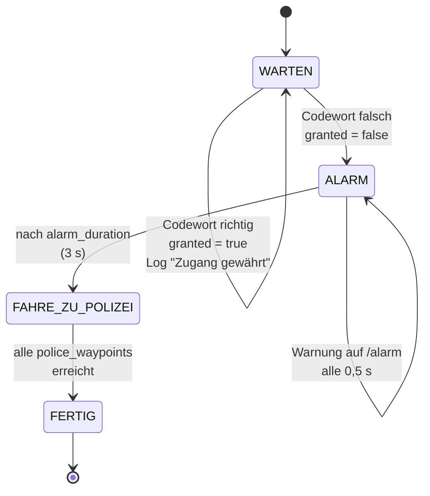
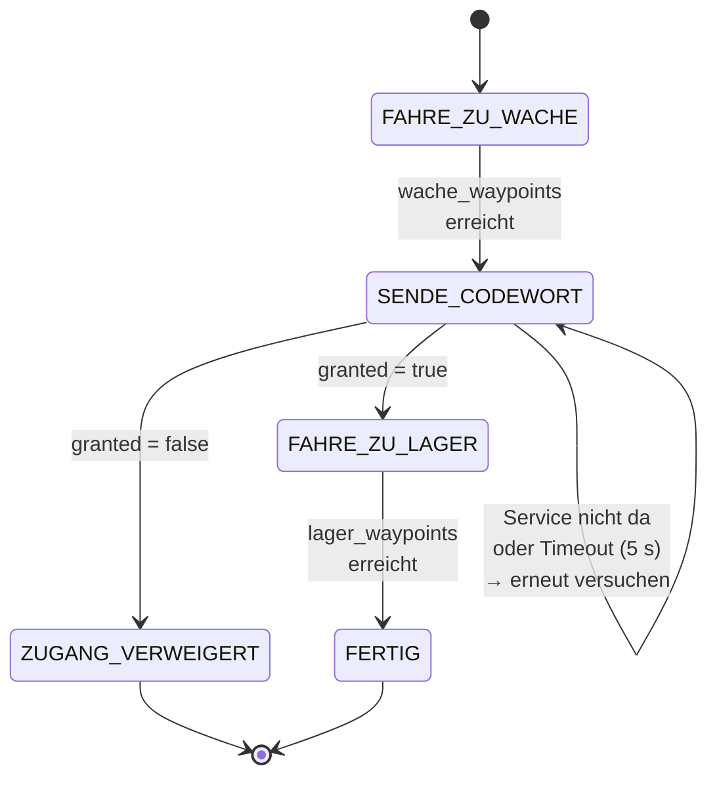

# Wachroboter — Thema 3


---

## 1. Szenario

Ein **Wachroboter** steht an einer festen Stelle im Flur und wartet. Ein zweiter Roboter, der **Besucher**, fährt auf ihn zu und nennt ein Codewort. Technisch ein ROS-2-Service-Aufruf über das gemeinsame WLAN.

| Was passiert | Technisch |
|---|---|
| Besucher fährt zur Wache | `visitor_robot` fährt eine Wegpunktliste ab |
| Besucher nennt das Codewort | Service-Aufruf `/check_codeword` an den Wachroboter |
| **Codewort richtig** | Wachroboter antwortet `granted=true` und bleibt stehen. Besucher fährt weiter zur **Zielposition 1 (Lager)** |
| **Codewort falsch** | Wachroboter antwortet `granted=false`, schlägt 3 Sekunden Alarm auf `/alarm` und fährt selbst zur **Zielposition 2 (Polizei)**. Der Besucher bleibt stehen |

Gefahren wird ausschließlich über Odometrie und Wegpunkte.
---

## 2. Architektur


| Paket | Was es tut |
|---|---|
| `wachroboter_interfaces` | Definiert den Service `CheckCodeword.srv`, welche gemeinsam für die beiden Roboter genutzt werden |
| `waypoint_driver` | Fährt eine Liste von (x, y)-Wegpunkten per Odometrie ab, mit Notstopp über `/scan`. Wiederverwendbare Klasse, die beide Roboter einbinden |
| `guard_robot` | Der Wachroboter: Service-Server, Codewortprüfung, Alarm, Fahrt zur Polizei |
| `visitor_robot` | Der Besucher: Service-Client, Fahrt zur Wache, je nach Antwort weiter zum Lager oder Stopp |
| `wachroboter_bringup` | Launch- und YAML-Dateien für echten Betrieb (`guard.launch.py`, `visitor.launch.py`) und Simulation (`sim.launch.py`) |

---

## 3. Statemachines

### Wachroboter (`guard_robot`)



Im Zustand `WARTEN` steht der Roboter, die Fahr-Node ist gesperrt. Anfragen in jedem anderen Zustand werden mit `granted=false` und dem Hinweis auf den aktuellen Zustand abgelehnt. Für einen neuen Durchlauf muss der Node neu gestartet werden.

### Besucher (`visitor_robot`)



Der Service-Aufruf ist **asynchron**. Ein blockierender Aufruf wäre hier ein Deadlock, weil er aus einem Timer-Callback heraus passiert. Läuft der Timeout ab, wird die offene Anfrage mit `remove_pending_request()` verworfen und neu gesendet.

---

## 4. Topics und Services

### Topics

| Name | Typ | Published von | Subscribed von |
|---|---|---|---|
| `/odom` | `nav_msgs/msg/Odometry` | Volksbot-Basistreiber (im Test `fake_odom_node`) | `waypoint_driver` |
| `/scan` | `sensor_msgs/msg/LaserScan` (BEST_EFFORT) | Laserscanner · im Test `fake_scan_node` | `waypoint_driver` |
| `/cmd_vel` | `geometry_msgs/msg/Twist` | `waypoint_driver` | Volksbot-Basistreiber (im Test `fake_odom_node`) |
| `/alarm` | `std_msgs/msg/String` | `guard_robot` | von keiner Node, zum Mitlesen per `ros2 topic echo` |
| `/waypoints_done` | `std_msgs/msg/Bool` (TRANSIENT_LOCAL) | `waypoint_driver` | keiner Node, die Statemachines fragen stattdessen `isFinished()` direkt ab |
| `/tf` | `tf2_msgs/msg/TFMessage` | `fake_odom_node` (nur im Test) | RViz |


### Service

| Name | Typ | Server | Client |
|---|---|---|---|
| `/check_codeword` | `wachroboter_interfaces/srv/CheckCodeword` | `guard_robot` | `visitor_robot` |

```
# wachroboter_interfaces/srv/CheckCodeword.srv
string codeword     # Anfrage: das genannte Codewort
---
bool granted        # Antwort: Zugang erlaubt?
string message      # Antwort: Begründung im Klartext
```

---

## 5. Parameter

### `guard_robot`

| Parameter | Bedeutung | Standard | Einheit |
|---|---|---|---|
| `valid_codewords` | Liste aller gültigen Codewörter | `["apfelkuchen", "nordlicht"]` | – |
| `case_sensitive` | Groß-/Kleinschreibung beim Vergleich beachten | `false` | – |
| `police_waypoints` | Wegpunkte zur Zielposition 2, flach als `x1,y1,x2,y2,…` | `[2.0, 0.0, 2.0, 2.0]` | m |
| `alarm_duration` | Dauer der Alarmphase, bevor losgefahren wird | `3.0` | s |
| `alarm_interval` | Abstand zwischen zwei Alarm-Nachrichten | `0.5` | s |
| `alarm_text` | Inhalt der Nachricht auf `/alarm` | `"ALARM: Falsches Codewort! Unbefugte Person erkannt."` | – |
| `state_frequency` | Takt der Zustandsmaschine | `10.0` | Hz |

### `visitor_robot`

| Parameter | Bedeutung | Standard | Einheit |
|---|---|---|---|
| `codeword` | Codewort, das gesendet wird | `"apfelkuchen"` | – |
| `service_name` | Name des Services beim Wachroboter | `"/check_codeword"` | – |
| `wache_waypoints` | Wegpunkte bis kurz vor den Wachroboter | `[1.5, 0.0]` | m |
| `lager_waypoints` | Wegpunkte zur Zielposition 1 (Lager) | `[1.5, 2.0, 0.0, 2.0]` | m |
| `service_timeout` | Maximale Wartezeit auf die Antwort | `5.0` | s |
| `service_retry_interval` | Abstand der "Service nicht verfügbar"-Meldungen | `2.0` | s |
| `state_frequency` | Takt der Zustandsmaschine | `10.0` | Hz |

### `waypoint_driver`

| Parameter | Bedeutung | Standard | Einheit |
|---|---|---|---|
| `waypoints` | Wegpunkte beim Start, flach als `x1,y1,x2,y2,…` | `[]` | m |
| `auto_start` | Sofort losfahren? `guard_robot` und `visitor_robot` setzen das auf `false` | `true` | – |
| `kp_angular` | Verstärkung des Drehreglers | `1.5` | 1/s |
| `kp_linear` | Verstärkung des Fahrreglers | `0.6` | 1/s |
| `max_linear_speed` | Obergrenze Fahrgeschwindigkeit | `0.2` | m/s |
| `max_angular_speed` | Obergrenze Drehgeschwindigkeit | `0.5` | rad/s |
| `goal_tolerance` | Ab diesem Abstand gilt ein Wegpunkt als erreicht | `0.15` | m |
| `angle_tolerance_deg` | Ab dieser Genauigkeit wird von Drehen auf Fahren umgeschaltet | `6.0` | ° |
| `safety_distance` | Notstopp, wenn ein Hindernis näher ist | `0.4` | m |
| `safety_angle_deg` | Halber Öffnungswinkel des überwachten Sektors vorne | `30.0` | ° |
| `control_frequency` | Takt der Regelschleife | `20.0` | Hz |

### `fake_robot` (nur Simulation)

| Node | Parameter | Bedeutung | Standard | Einheit |
|---|---|---|---|---|
| `fake_odom_node` | `publish_rate` | Rate von `/odom` und TF | `50.0` | Hz |
| `fake_scan_node` | `publish_rate` | Rate von `/scan` | `10.0` | Hz |
| `fake_scan_node` | `range_value` | Distanz auf allen Strahlen | `10.0` | m |

**Wichtig zu allen Wegpunkten:** Sie gelten **relativ zur Startpose** des jeweiligen Roboters, nicht absolut. `x` zeigt nach vorne, `y` nach links — aus Sicht des Roboters in dem Moment, in dem er die erste `/odom`-Nachricht bekommt. 

---

## 6. Installation


### Bauen

```bash
cd ~/ws_grp4
source /opt/ros/jazzy/setup.bash
colcon build --symlink-install
source install/setup.bash
```

In **jedem** weiteren Terminal:

```bash
cd ~/ws_grp4 && source install/setup.bash
```

---

## 7. Start

**Beide Roboter**, in jedem Terminal vor allem anderen:

```bash
export ROS_DOMAIN_ID=69
cd ~/ws_grp4 && source install/setup.bash
```

**Roboter A (Wache)** — an der Wachposition aufstellen, Blickrichtung Flur:

**Terminal 1**

```bash
source install/setup.bash
ros2 launch volksbot_driver volksbot_lidar_sick_grp4.py robot_ns:=guard
```
**Terminal 2**

```bash
source install/setup.bash
ros2 launch wachroboter_bringup guard.launch.py namespace:=guard
```

**Roboter B (Besucher)** — an der Startposition aufstellen:

**Terminal 1**
```bash
cd ws_grp4/
export ROS_DOMAIN_ID=69
source install/setup.bash
ros2 launch volksbot_driver volksbot_lidar_slamtec_grp4.py robot_ns:=visitor
````

**Terminal 2**
```bash
cd ws_grp4/
export ROS_DOMAIN_ID=69
source install/setup.bash
```
FALSCHES CODEWORT:
```bash
ros2 launch wachroboter_bringup visitor.launch.py namespace:=visitor codeword:=banane
```

RICHTIGES CODEWORT:
```bash
ros2 launch wachroboter_bringup visitor.launch.py namespace:=visitor codeword:=apfelkuchen
````

Alarmfall:

```bash
ros2 launch wachroboter_bringup visitor.launch.py codeword:=banane
```

Reihenfolge zählt: erst der Wachroboter, dann der Besucher. Startet der Besucher zuerst, wartet er und meldet alle zwei Sekunden `Service '/check_codeword' noch nicht verfuegbar. 


---

## 8. Wer hat was gemacht

| Paket / Bereich | Person |
|---|---|
| `wachroboter_interfaces` | Aaron, Maxim, Harris |
| `waypoint_driver` | Aaron, Maxim, Harris |
| `guard_robot` | Romeo, Aaron, Maxim |
| `visitor_robot` | Romeo |
| `wachroboter_bringup` | Alle |
| Repo-Setup, Projektplan, Merges | Romeo|
| Tests im Flur, Einmessen der Wegpunkte | Alle |
| Präsentation und Video | Alle | 


---

## 9. Bekannte Einschränkungen

**Odometrie-Drift.** Die Position wird ausschließlich aus den Radencodern integriert. Jeder Schlupf auf glattem Boden, jede Unebenheit und jede Ungenauigkeit im Raddurchmesser addiert sich auf und wird nie korrigiert. Nach wenigen Metern weicht die geschätzte Position spürbar von der echten ab, bei Drehungen stärker als beim Geradeausfahren. Gegenmittel im Projekt: kurze Strecken, wenige Wegpunkte und `goal_tolerance` auf großzügigen 0,15 m.

**Kein Nav2, keine Karte, kein SLAM.** Der Roboter weiß nicht, wo er ist — er weiß nur, wie weit er seit dem Start gefahren ist. Es gibt keine Lokalisierung, keine Pfadplanung und kein Ausweichen. Steht ein Hindernis im Weg, bleibt der Roboter stehen und wartet, bis der Weg frei ist; er sucht keine Umgehung.

**Kein Rückwärtsfahren, keine Kurvenfahrt.** Der `waypoint_driver` dreht erst auf der Stelle zum Ziel und fährt dann geradeaus. Das ist robust und leicht nachvollziehbar, aber langsamer und ruckeliger als eine kombinierte Bewegung.

**Sicherheitsprüfung nur nach vorne.** Überwacht wird ein Sektor von ±30° vor dem Roboter. Ein Hindernis seitlich oder hinter dem Roboter wird nicht bemerkt.

**Statemachines laufen genau einmal durch.** Beide enden im Zustand `FERTIG` beziehungsweise `ZUGANG_VERWEIGERT` und lassen sich nicht zurücksetzen. Für jeden weiteren Durchlauf müssen beide Nodes neu gestartet werden.

**Wegpunkte sind starr.** Sie sind relativ zur Startpose angegeben. Steht ein Roboter beim Start ein paar Zentimeter versetzt oder leicht verdreht, verschiebt sich die gesamte Fahrt mit. Deshalb sollten die Startpositionen im Flur markiert werden.

**Nur ein Besucher.** Der Wachroboter bearbeitet eine Anfrage und wechselt danach den Zustand. Mehrere Besucher hintereinander sind nicht vorgesehen.
